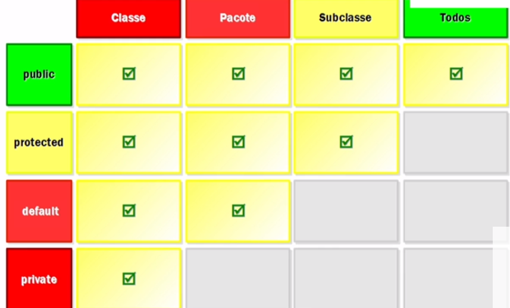

# Access Modifiers

In Java, access modifiers are keywords that are used to control the visibility and accessibility of classes, methods, and variables. There are four access modifiers in Java:

public: accessible from anywhere
protected: accessible within the same package and by subclasses in different packages
default (no modifier): accessible within the same package only
private: accessible within the same class only
Here's a summary of what each access modifier does:

public: Allows access to the class, method, or variable from anywhere in the code, including from other packages.

protected: Allows access to the class, method, or variable from within the same package and from subclasses in other packages.

default (no modifier): Allows access to the class, method, or variable from within the same package only.

private: Restricts access to the class, method, or variable to the same class only.

Here's an example of access modifiers in Java:

```
public class MyClass {
    public int publicVar = 1;
    protected int protectedVar = 2;
    int defaultVar = 3; // default access modifier
    private int privateVar = 4;

    public void publicMethod() {
        System.out.println("This is a public method.");
    }

    protected void protectedMethod() {
        System.out.println("This is a protected method.");
    }

    void defaultMethod() {
        System.out.println("This is a default method.");
    }

    private void privateMethod() {
        System.out.println("This is a private method.");
    }
}

```

In this example, we've defined a class called MyClass with four fields and four methods, each with a different access modifier.

The publicVar field and publicMethod() method are accessible from anywhere in the code.

The protectedVar field and protectedMethod() method are accessible within the same package and by subclasses in other packages.

The defaultVar field and defaultMethod() method have default access, which means they are accessible within the same package only.

The privateVar field and privateMethod() method are only accessible within the same class.

Note that the default access modifier is not explicitly specified in the example above. If no access modifier is specified for a class, method, or variable, it has default access.

